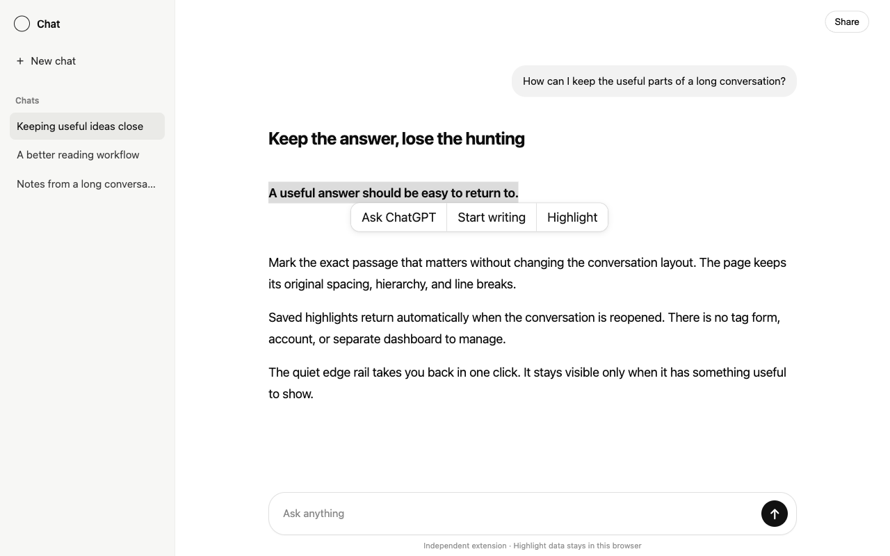

<div align="right">

**English** · [中文](./README.zh-CN.md)

</div>

<br />

<div align="center">

# highlights-for-chatgpt

**Keep what matters. Return without searching.**
<br/>
A quiet, native-feeling highlight layer for ChatGPT — with automatic restore,
exact jump-back, a Library, and local export.

<br/>

<a href="LICENSE"></a>


</div>

<br/>

## What it does

Long ChatGPT conversations are easy to read and hard to revisit. Select the
sentence that matters, choose **Highlight**, and it returns whenever that
conversation is reopened.

- Four restrained colors, with recolor and remove in the same compact menu.
- One edge marker per saved passage; hover to preview, click to return.
- A **Highlights** view inside ChatGPT's Library for search, filtering, preview,
  source navigation, and selected export.
- Markdown, plain-text, and JSON backup export from local storage.
- Optional, allow-listed integration with a compatible ChatGPT Markdown
  exporter, preserving highlight text and color in the current conversation.

No popup, side panel, tag form, account, cloud service, analytics, advertising,
AI processing, or remote code.

<br/>

## The interaction

```text
Select text  →  Highlight  →  reopen any time  →  jump back exactly
                                      ↓
                              Library · export
```

The extension joins ChatGPT's existing selection toolbar. Clicking a saved
highlight opens the same restrained color picker; the rightmost action removes
it. The navigation rail shares the rhythm of ChatGPT's own conversation rail
instead of competing for a second edge.

<br/>

## Library



The Library is conversation-first, not a database dump. Search and color filters
narrow the current decision; preview opens one passage; checkboxes appear only
when selection is relevant. List and grid views reuse the currently loaded
ChatGPT component geometry and theme tokens, with isolated fallbacks for host
changes.

<br/>

## Why it does not break the page

Highlights are painted with the browser's
[CSS Custom Highlight API](https://developer.mozilla.org/docs/Web/API/CSS_Custom_Highlight_API).
The extension stores text ranges and paints them without wrapping, splitting,
or reparenting ChatGPT's message DOM. That preserves paragraphs, nested emphasis,
lists, line breaks, and the page hierarchy.

Restoration combines exact text, nearby context, duplicate occurrence, whitespace
normalization, and delayed reconciliation for ChatGPT's dynamic rendering.

<br/>

## Privacy

Selected text, short anchor context, the matching conversation URL/title, color,
and timestamps stay in extension-owned IndexedDB. There is no developer server
and no telemetry. Nothing is sent to the developer or a third party.

The optional exporter bridge is direct extension-to-extension messaging,
restricted to one allow-listed extension and the current conversation. It does
not expose records to page scripts or send them over a network.

Read the full [privacy policy](PRIVACY.md) and [support guidance](SUPPORT.md).

<br/>

## Install

The Chrome Web Store listing is being prepared. To install from source now:

```bash
git clone https://github.com/O0000-code/highlights-for-chatgpt.git
cd highlights-for-chatgpt
bun install --frozen-lockfile
bun run verify
```

Open your Chromium browser's extensions page, enable **Developer mode**, choose
**Load unpacked**, and select `dist/`.

<br/>

## Development

```bash
bun run fix
bun run typecheck
bun run test
bun run build
bun run package
```

The unpacked extension is written to `dist/`; the release ZIP is written to
`releases/`. Store screenshots are synthetic and contain no real conversation
content.

<br/>

## Scope, attribution, and license

The product boundary is documented in [docs/product-scope.md](docs/product-scope.md).
It intentionally excludes accounts, sync, analytics, tags, notes, engagement
features, custom themes, and direct dependencies on ChatGPT's private React
internals.

Highlights for ChatGPT is independent and is not affiliated with, endorsed by,
or sponsored by OpenAI. ChatGPT is a trademark of OpenAI.

The project was informed by Threadmark's MIT-licensed local-first anchoring work.
Exact attribution and dependency notices are in
[THIRD_PARTY_NOTICES.md](THIRD_PARTY_NOTICES.md).

MIT — see [LICENSE](LICENSE).
